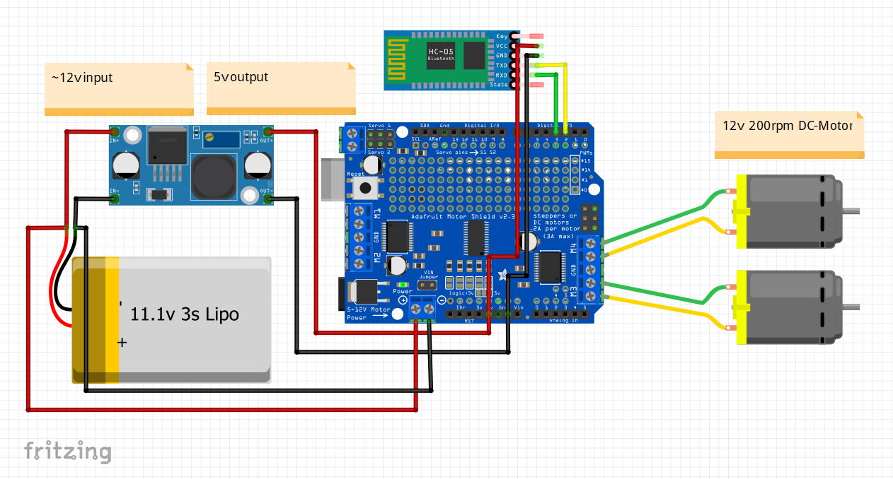

# 3D-printed-Tank

This is my first 3D–printed Tank. The design is very simple, but there is no suspension for the Tracks yet, so be careful when driving. It is controlled by a Arduino uno over a Bluetooth connection with ‘RemoteXY’. You need about 50 hours to print all the parts and 400g filament.
To assemble the 2 complete Tracks you need to print 108 Tracks (54 per side) and 108pcs of 33mm long and 0.7mm thick wire to connect them. I would recommend you to first print the small adapters (BearingAdapter.stl or MotorAdapter.stl), to make sure you can screw in the M3 screws. Because it’s very important that they hold strong enough.

Download 3D-Files: https://www.thingiverse.com/thing:4888865

# Materials list:

- 2x 608Z bearing
- 8x F625Z bearing
- 4x M3 x 12 screws
- 5x M3 x 10 screws
- 8x M3 x 12 Flat Head screws
- 8x M5 x 20 screws
- 0.7mm Wire ~3,6m length 

- 2x DC – motor (12v, 200rpm, (25mm diameter))
- Step down module
- Arduino uno
- Adafruit motor shield v2.3
- Hc05/06 Bluetooth module
- 11.1v 3s Lipo Battery (~42 x ~140 x ~20)

# Wiring:

It is very important, that the Baudrate of your HC05/06 is set to 9600. There are many tutorials in the internet that show how to do this. 

# Connect with RemoteXY:

First of all you download the free version of the RemoteXY app to your Smartphone. Then you click on the '+' in the top right corner, choose Bluetooth and connect to your HC05/06. The default password is '1234', you can change that in the Arduino code.
